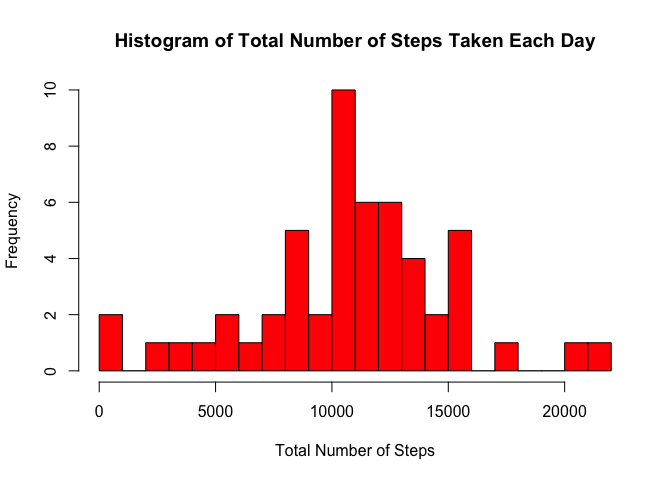
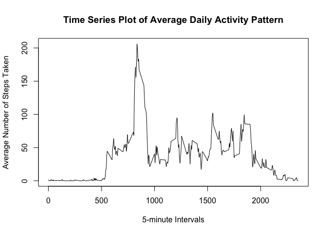
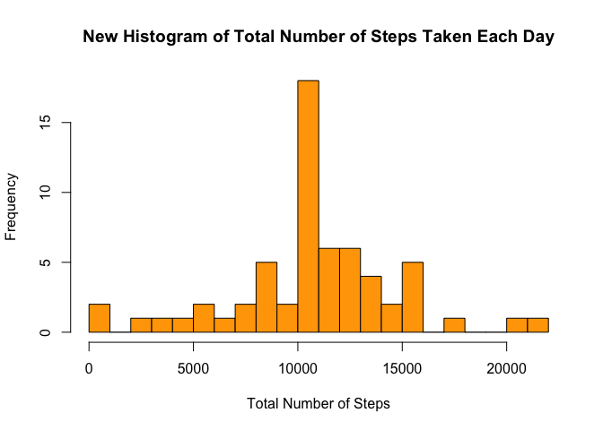

# Reproducible Research: Peer Assessment 1
Michael Lee  
July 13, 2015  


## Loading and preprocessing the data


```r
# Load activity data
data <- read.csv("activity.csv")
```

## What is mean total number of steps taken per day?


```r
# Group the number of steps by date
steps.date <- aggregate(steps ~ date, data = data, FUN = "sum")

# Make histogram
hist(steps.date$steps, main = "Histogram of Total Number of Steps Taken Each Day",
     xlab = "Total Number of Steps", col = "red", breaks = 20)
```

 

```r
# Calculate the mean and median number of steps taken per day
mean(steps.date$steps)
```

```
## [1] 10766.19
```

```r
median(steps.date$steps)
```

```
## [1] 10765
```

## What is the average daily activity pattern?


```r
# Group the average number of steps by 5-minute interval
steps.intv <- aggregate(steps ~ interval, data = data, FUN = "mean")

# Make time series plot
plot(steps ~ interval, data = steps.intv, type = "l",
     main = "Time Series Plot of Average Daily Activity Pattern",
     xlab = "5-minute Intervals", ylab = "Average Number of Steps Taken")
```

 

```r
# Find the 5-minute interval that contains the maximum number of steps
steps.max.intv <- steps.intv$interval[which(steps.intv$steps == max(steps.intv$steps))]
steps.max.intv
```

```
## [1] 835
```

The 5-minute interval beginning at the 835th minute of the day contains the maximum number of steps, on average across all the days.

## Inputing missing values


```r
# Total number of missing values in the dataset
sum(is.na(data))
```

```
## [1] 2304
```

```r
# Fill in all the missing values with mean for that 5-minute interval
data.filled <- data
for (row in which(is.na(data.filled$steps))) {
  data.filled$steps[row] <- as.numeric(steps.intv[steps.intv$interval == data.filled$interval[row],]["steps"])
}

# Group the number of steps by date
steps.date.filled <- aggregate(steps ~ date, data = data.filled, FUN = "sum")

# Make histogram
hist(steps.date.filled$steps, main = "New Histogram of Total Number of Steps Taken Each Day",
     xlab = "Total Number of Steps", col = "orange", breaks = 20)
```

 

```r
# Calculate the mean and median number of steps taken per day
mean(steps.date.filled$steps)
```

```
## [1] 10766.19
```

```r
median(steps.date.filled$steps)
```

```
## [1] 10766.19
```

After filling in the missing values, the new mean number of steps taken per day remained the same as before. The new median number of steps taken per day is now same as the new mean. Inputting missing data has the impact of causing a smaller variance to the distribution of daily number of steps.

## Are there differences in activity patterns between weekdays and weekends?


```r
library(lattice)

# Build a factor variable with two levels: weekday and weekend
data.filled$weekdays <- factor(format(as.Date(data.filled$date), "%A"))
levels(data.filled$weekdays) <- list(weekday = c("Monday", "Tuesday", "Wednesday", "Thursday", "Friday"),
                                     weekend = c("Saturday", "Sunday"))

# Make panel plot
steps.mean.filled <- aggregate(data.filled$steps,
                               list(interval = as.numeric(as.character(data.filled$interval)),
                                    weekdays = data.filled$weekdays), FUN = "mean")
names(steps.mean.filled)[3] <- "means"
xyplot(steps.mean.filled$means ~ steps.mean.filled$interval | steps.mean.filled$weekdays,
       layout = c(1, 2), type = "l", xlab = "Interval", ylab = "Number of steps")
```

 

The plot shows that there are differences in activity patterns between weekdays and weekends. The distribution of activity is more uniformly distributed throughout the day on weekends. On weekdays, there appears to be a spike of activity in the morning, and less activity for the rest of the day.
